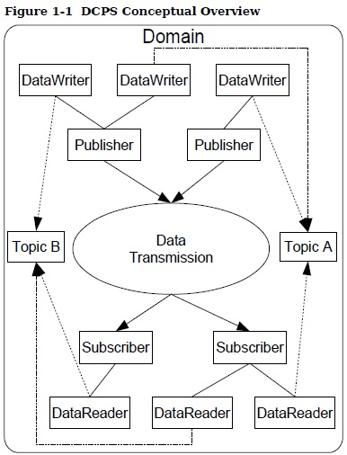
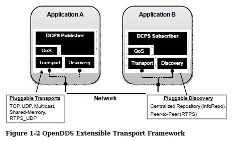

# OpenDDS Quick-Start

*声明：本文档基本上是`OpenDDS-3.19.pdf`[^guide] 的拙劣翻译。写完才发现GitHub有人贴繁体版[^github]。😓😓😓*

[TOC]
# OpenDDS在 Ubuntu 环境下的编译

这部分内容基本参考自 [CSDN博客1](https://blog.csdn.net/Fan0628/article/details/89494252) 和 [CSDN博客2](https://blog.csdn.net/wyc12306/article/details/79665454)

## 一、准备

### 1.0 环境及版本

- Nvidia Xavier aarch64
- Ubuntu 18.04.6 LTS
- perl 5.34.0
- ACE+TAO 7.0.6
- OpenDDS 3.19
- make GNU Make 4.1
- gcc 7.5.0

### 1.1 安装Perl

Perl下载地址：http://www.perl.org/get.html

```shell
wget https://www.cpan.org/src/5.0/perl-5.34.0.tar.gz
tar -xvzf perl-5.34.0.tar.gz
cd perl-5.34.0

./Configure -d
make -j 8
make test
sudo make install 

cd ~
perl -V
rm -rf perl-5.34.0.tar.gz
rm -rf perl-5.34.0/
```

### 1.2 下载ACE+TAO与OpenDDS

ACE+TAO下载地址：https://download.dre.vanderbilt.edu/
OpenDDS下载地址：https://download.objectcomputing.com/OpenDDS/

下载时注意：

ACE+TAO下载选择FULL版本。
FULL版本：包含所有GNU make预生成makefile的源代码；
Sources only版本：仅包含源代码，需要使用MPC生成makefile。

### 1.3 解压安装ACE+TAO与OpenDDS

将 ACE+TAO 与 OpenDDS 解压至/DevOpenDDS目录下

```shell
wget https://github.com/DOCGroup/ACE_TAO/releases/download/ACE%2BTAO-7_0_6/ACE+TAO-7.0.6.tar.gz
mkdir DevOpenDDS
sudo tar -zxvf ACE+TAO-7.0.6.tar.gz -C DevOpenDDS
wget https://download.objectcomputing.com/OpenDDS/OpenDDS-3.19.tar.gz
sudo tar -zxvf OpenDDS-3.19.tar.gz -C DevOpenDDS

rm ACE+TAO-7.0.6.tar.gz
rm OpenDDS-3.19.tar.gz
```

解压完毕后，在DevOpenDDS目录下已存在ACE_wrappers和OpenDDS两个文件夹，==修改其权限==
（这步很有必要，不修改权限会在编译时出现Permission denied的情况）

```shell
cd DevOpenDDS
sudo chmod 777 -R ACE_wrappers/
sudo chmod 777 -R OpenDDS-3.19/
```

### 1.4 设置相关环境变量

在/etc/profile文件尾添加如下环境变量，`source /etc/profile`

```shell
# ACE+TAO+DDS Environment
export ACE_ROOT=/home/nvidia/DevOpenDDS/ACE_wrappers
export TAO_ROOT=$ACE_ROOT/TAO
export DDS_ROOT=/home/nvidia/DevOpenDDS/OpenDDS-3.19
export PATH=$ACE_ROOT/bin:$DDS_ROOT/bin:$PATH
export LD_LIBRARY_PATH=$ACE_ROOT/lib:$DDS_ROOT/lib:$LD_LIBRARY_PATH
```

## 二、编译

### 2.1 设置config.h

新建 `$ACE_ROOT/ace/config.h`，文件内容为

```shell
#include "ace/config-linux.h"
```

### 2.2 设置Platform_macros.GNU

新建`$ACE_ROOT/include/makeinclude/platform_macros.GNU`，文件内容为

```shell
include $(ACE_ROOT)/include/makeinclude/platform_linux.GNU
```

### 2.3 编译

编译顺序为：ACE -> TAO -> DDS，编译时间相当长，需要占用9GB空间。这个时间可以先看下面的内容。

```shell
# ACE
cd $ACE_ROOT
# make clean
make -j 8

# TAO
cd $TAO_ROOT
# make clean
make -j 8

#DDS
cd $DDS_ROOT
./configure
# make clean
make -j 8
```

### 2.4 运行测试脚本

编译完成后，运行测试脚本测试OpenDDS环境是否搭建成功。
到 `$DDS_ROOT/examples/DCPS/Messenger_Imr` 目录，运行  `run_test.pl` 。

```shell
cd $DDS_ROOT/example/DCPS/Messenger_Imr
./run_test.pl
```

运行结果显示 *test PASSED*，测试成功。


# DDS 是什么

DDS：Data Distribution Service 数据分发服务，也指新一代分布式实时通信中间件协议。

DDS 采用发布/订阅体系架构，强调**以数据为中心**，提供丰富的 QoS 服务质量策略，以保障数据进行实时、高效、灵活地分发，可满足各种分布式实时通信应用需求。它基于 DCPS（Data-Centric Publish-Subscribe, 以数据为中心的发布-订阅）模型。

DDS规范列举并正式定义了一整套全面的QoS（Quality of Service，服务质量）策略，能利用QoS进行系统控制。

# OpenDDS 是什么

OpenDDS  是针对  OMG（Object Management Group，对象管理组织） 的 *Data Distribution Service (DDS) for Real-Time Systems Specification* 和 *Realtime Publish-Subscribe Wire Protocol DDS Interoperability Wire Protocol Specification (DDSI-RTPS)* 的一个开源实现方案，由 OCI 公司设计和维护，采用C++语言实现，但也提供 JAVA 和 JMS 的开发接口。

# DCPS 基本概念

DCPS  指的是 Data-Centric Publish-Subscribe 以数据为中心的发布-订阅层，是 DDS 的核心和基础，提供通信的基础服务。



- *Domain* 域，域是 DCPS 中的基本区分单元，由 DomainID 唯一标识。域中的东西称为 实体 *Entity* ，只有在同一个域中的实体才能通信。
- *DomainParticipant* 域参与者，是域的入口点，其他实体先获取 *DomainParticipant*，然后再获取其他服务，如publisher，subscriber，topic等
- *Topic* 话题，由 TopicName 唯一标识，关联了相应的数据类型 DataType
- *DataWriter* 数据写入器，每个数据写入器都绑定到 *Topic* 上，类似缓存
- *DataReader* 数据读取器，和 *DataWriter* 对应
- *Publisher* 发布者，至少和1个 *DataWriter* 关联， 通过调用 *DataWriter* 的函数把数据发出去
- *Subscriber* 订阅者，至少和1个 *DataReader* 关联

## 内建的 Topic

这些内建 *Topic* 可以展示域的状态，包括哪个主题被注册，哪个*DataReader*、*DataWriter* 被连接以及被断开，以及各种各样实体的QoS设置

| Topic Name       | Description                                  |
| ---------------- | -------------------------------------------- |
| DCPSParticipant  | 每个实例代表了一个域参与者 DomainParticipant |
| DCPSTopic        | 每个实例代表了一个标准的（非内建的）主题     |
| DCPSPublication  | 每个实例代表了一个DataWriter                 |
| DCPSSubscription | 每个实例代表了一个DataReader                 |

## QoS策略

支持一堆QoS策略，策略可以应用到所有实体上。

*Subscriber* 和 *Publisher* 通过使用请求-提供（Request-Offered，RxO）模式进行匹配。Subscriber *request* 一组应满足的QoS策略，Publisher *offer* 一组能实现的QoS 策略，然后尝试匹配，匹配上就关联上。

## 监听器 Listener 

DCPS层为每个实体定义回调接口，其允许应用进程 “监听” 关于该实体的某些状态改变或事件。例如，当有可用于读取的数据值时，通知 *Data Reader Listener*。

## 条件 Conditions

允许 *Conditions* 和 *Wait Sets* 代替 *Listeners* 监听有关的 DDS。

  * 一般模式是应用程序创建一个特定类型的*Condition*，例如*StatusCondition*，并将其附加到*WaitSet*。
  * 应用程序等待*WaitSet*，直到一个或多个 *Conditions* 为 *true*。
  * 应用程序调用对相应实体对象以提取必要的信息。
  * *DataReader* 接口还具有读取*ReadCondition*参数的方法。
  * *QueryCondition* 对象可以被作为实现 Content-Subscription 。 QueryCondition 可用来扩展 ReadCondition。

# OpenDDS 实现

OpenDDS符合OMG DDS和OMG DDSI-RTPS规范。

## 兼容性 Compliance

DDS规范定义了DDS实现的5点兼容性：

1. 最低配置文件
2. 内容订阅配置文件
3. 持久性
4. 所有权
5. 对象模型配置文件

OpenDDS符合DDS规范，实现了所有QoS策略，只不过带有两点注释：

- `RELIABILITY.kind = RELIABLE`  在使用RTPS_UDP、TCP、IP多播时才支持
- 由于QoS可变，所以没有实现 `TRANSPORT_PRIORITY`。

## 可拓展传输框架

OpenDDS使用 DDS 规范定义的 IDL 接口来初始化和控制服务使用。数据传输通过 OpenDDS 特定的传输框架来实现，该传输框架允许服务与各种传输协议一起使用。这被称为可插拔传输，使 OpenDDS 的可扩展性成为其架构的重要组成部分。 **OpenDDS目前支持 TCP/IP，UDP/IP ，IP multicast，共享存储和 RTPS_UDP 传输协议；也可以自己定制**。传输通常通过配置文件指定，并附加到发布者和订阅者进程中的各种实体。



## 发现机制

OpenDDS实现了两种节点发现机制：

- `DCPSInfoRepo`: Information Repository，集中式的，一个单独的进程，和`roscore`类似吧
- `RTPS`: 使用 RTPS协议的点对点对等发现，和其他 DDS 实现的交互必须用 RTPS  模式。

注意，**发现机制和后面数据发送使用的协议是没有关系的**，在 *transport* 的时候可以指定用 udp tcp 等等

基本概念就说这么多，后面用到再补充。还有一些*架构*、*理念*和*设计哲学*之类的东西看都看不懂…

# 开发实例
==这里的代码我做了修改，和仓库里 example 中的代码匹配，和原始DevGuide PDF中内容有点不一致==

原始代码在 `$DDS_ROOT/DevGuideExamples/DCPS/Messenger` 文件夹，也可以参考Opendds的在线文档[^doxygen]

## 通过 IDL 定义 DataType

### 定义话题类型

通过 OMG 的 Interface Definition Language (IDL) 定义 DataType

以这样一个 idl 文件为例： [Messenger.idl](example/Messenger.idl) 

```idl
module Messenger {
	@topic
	struct Message {
		string from;
		string subject;
		@key long subject_id;
		string text;
		long count;
	};
};
```

`@topic` 表明了上面的 DataType 可以用作一个 *topic* 的 type。它必须是一个结构体`struct`或者联合体`union`。可以包括多种数据类型，比如 `basic types (short, long, float, etc.), enumerations, strings, sequences, arrays, structures, and unions.`

### keys 键

`@key` 表明这个字段 *fields*用来做这个*topic*的 键 *key*，一个*topic*可以有0到任意多个*key*。

***key* 是用来识别不同的 *Instace* 的**。上面的代码中，同一个 *topic* 下的不同的 `subject_id` 就认为是不同的 `Instance`；在默认的 QoS策略下，旧的 *sample* 会被 后面的相同 `subject_id` 的*sample*替代。

**补充**：*object* 、*instance*、*sample*  他们的语义是不一样的，举个例子：

一个对象叫 `机器`                                                                             -> object

分别有两个安在路上的测速`机器`叫 `测速机1`  、`测速机2`             -> instance

他们有一个属性叫编号，分别是 1 、 2 ，用来区分                    -> key

他们会按周期发送测出来的速度                                                   -> sample

那什么可以做*key*呢？基本类型 `booleans, integers, characters, and strings`都可以做*key*；定义了 *key* 的其他结构也可以做 *key*；没定义*key*的其他结构也可以，那就默认都是*key*，除了用 `@key(FALSE)` 声明了不是*key*的，😓例子（这个不是主线例子）：

```idl
struct InnerStruct {
	long a;
	short b;
	@key(FALSE) char c;
};
@topic
struct OuterStruct {
	@key InnerStruct value;
	// Now just value.a and value.b are the keys
};
```

`union` 也能做 *key*，但是用 union 做key的不能指定为 topic type。

## 编译 IDL

### 一般流程

使用 `tao_idl` 编译生成网络传输所需的文件，
```sh
tao_idl Messenger.idl
# 然而这个命令会报错，一个完整的命令例子
tao_idl -Wb,pre_include=ace/pre.h -Wb,post_include=ace/post.h -I /home/nvidia/DevOpenDDS/ACE_wrappers/TAO --idl-version 4 --unknown-annotations ignore -as -Sa -St -I/home/nvidia/DevOpenDDS/OpenDDS-3.19 -I/home/nvidia/DevOpenDDS/ACE_wrappers/TAO/orbsvcs Messenger.idl
```
将会生成六个（或者五个）文件
```sh
<filename>C.cpp
<filename>C.h
<filename>C.inl
<filename>S.cpp
<filename>S.h
<filename>S.inl
```


使用OpenDDS IDL编译器处理IDL文件，以生成OpenDDS需要编译和解密消息的序列化和密钥支持代码，以及 *data reader* 和 *data writer* 的类型代码。此 IDL 编译器位于 $DDS/ROOT/bin/ 中，并为每个处理的 IDL 文件生成三个文件。这三个文件都以原始IDL文件名开头

`opendds_idl Messenger.idl` 

生成下面这三文件

```sh
<filename>TypeSupport.idl
<filename>TypeSupportImpl.h
<filename>TypeSupportImpl.cpp
# 在这个例子里是下面三个

MessengerTypeSupport.idl
MessengerTypeSupportImpl.h
MessengerTypeSupportImpl.cpp
```

然而🙂上面这个过程一般都是编译系统帮你完成的，所以上面了解一下就行了。有两个选择：

- *MPC*, the “Make Project Creator” which is used to build OpenDDS itself and the majority of its included tests and examples
- *CMake*, a build system that’s commonly used across the industry (cmake.org)

### MPC编译
==这个也并不好用，我改了半天也不行。。。所以看看是咋回事就得了，后面还是用 CMake==
用 MPC 编译的话需要写 MPC 文件

```idl
project(*idl): dcps {
	// This project ensures the common components get built first.
	TypeSupport_Files {
		Messenger.idl
	}
	custom_only = 1
}
```

在这里，指定`dcps` 父工程包含了所需的规则；`TypeSupport_Files` 告诉 MPC 用OpenDDS IDL 编译器从  `Messenger.idl`  生成所需要的文件。

顺便说下怎么用  MPC 定义 *publisher* 和 *subscriber*。
- `dcpsexe` links in the DCPS library and the DCPSUDP library.
- `dcps_tcp` links in the DCPS library and the DCPS_TCP library.
- `dcps_rtps_udp` links in the DCPS library and the DCPS_Rtps_Udp library.
- `exename` 生成的文件名
- `after` 指定编译顺序

```idl
project(*publisher) : dcpsexe, dcps_tcp, dcps_rtps_udp {
  requires += no_opendds_safety_profile
  exename   = publisher
  after    += *idl

  TypeSupport_Files {
    Messenger.idl
  }

  Source_Files {
    Publisher.cpp
  }
}

project(*subscriber) : dcpsexe, dcps_tcp, dcps_rtps_udp {
  requires += no_opendds_safety_profile
  exename   = subscriber
  after    += *publisher

  TypeSupport_Files {
    Messenger.idl
  }

  Source_Files {
    DataReaderListenerImpl.cpp
    Subscriber.cpp
  }
}
```

## 编写 Publisher

按照逻辑拆分为：

### Initializing the Participant

```cpp
int ACE_TMAIN(int argc, ACE_TCHAR *argv[])
{
  try {
    // Initialize DomainParticipantFactory
    // 0 初始化 DomainParticipantFactory
    DDS::DomainParticipantFactory_var dpf =
      TheParticipantFactoryWithArgs(argc, argv);

    // Create DomainParticipant
    // 1 创建 DomainParticipant
    DDS::DomainParticipant_var participant =
      dpf->create_participant(42,
                              PARTICIPANT_QOS_DEFAULT,
                              0,
                              OpenDDS::DCPS::DEFAULT_STATUS_MASK);

    if (!participant) {
      ACE_ERROR_RETURN((LM_ERROR,
                        ACE_TEXT("ERROR: %N:%l: main() -")
                        ACE_TEXT(" create_participant failed!\n")),
                       1);
    }
```

`TheParticipantFactoryWithArgs` 宏 在 `Service_Participant.h` 中定义，并以命令列参数来初始化  *Domain Participant Factory*。这些命令参数用于初始化 ORB 也就是 OpenDDS 服务本身。这也允许我们略过 ORB_init()选项以及 OpenDDS 的 DCPS* 选项设定。

`create_participant()` 使用注册 ID为 42 的 domain。参与者使用默认的 QOS 而且不绑定 *listener* 。使用 OpenSSD 默认状态 mask 确保所有相关的沟通状态改变(像是 数据可用性、丢失) 时中间层可以和应用层沟通(例如 通过*listener* 回传)。

doamin ID 范围(0x00000000 ~ 0x7FFFFFFF)。==注意在 RTPS 实现中 ID 需要在 0 和 231之间。==


### Registering the Data Type and Creating a Topic

首先创建 `MessageTypeSupportImpl` 对象，然后用 `register_type() `方法注册类型

```cpp
    // Register TypeSupport (Messenger::Message)
    // 2 注册类型支持
    // 注意这个地方是 MessageTypeSupportImpl ，也就是idl文件中的 struct
    Messenger::MessageTypeSupport_var ts =
      new Messenger::MessageTypeSupportImpl;

    if (ts->register_type(participant, "") != DDS::RETCODE_OK) {
      ACE_ERROR_RETURN((LM_ERROR,
                        ACE_TEXT("ERROR: %N:%l: main() -")
                        ACE_TEXT(" register_type failed!\n")),
                       1);
    }
```
在这里留意下是 `Messenger::MessageTypeSupportImpl` 和 *idl* 中变量的关系。

然后获取类型名，用`create_topic()`方法创建 *topic*

```cpp
    // Create Topic (Movie Discussion List)
    // 3 创建 Topic， 只用改Topic Name
    CORBA::String_var type_name = ts->get_type_name();
    DDS::Topic_var topic =
      participant->create_topic("Movie Discussion List",
                                type_name,
                                TOPIC_QOS_DEFAULT,
                                0,
                                OpenDDS::DCPS::DEFAULT_STATUS_MASK);

    if (!topic) {
      ACE_ERROR_RETURN((LM_ERROR,
                        ACE_TEXT("ERROR: %N:%l: main() -")
                        ACE_TEXT(" create_topic failed!\n")),
                       1);
    }
```

### Creating a Publisher

```cpp
    // Create Publisher
    // 4 创建 Publisher
    DDS::Publisher_var publisher =
      participant->create_publisher(PUBLISHER_QOS_DEFAULT,
                                    0,
                                    OpenDDS::DCPS::DEFAULT_STATUS_MASK);

    if (!publisher) {
      ACE_ERROR_RETURN((LM_ERROR,
                        ACE_TEXT("ERROR: %N:%l: main() -")
                        ACE_TEXT(" create_publisher failed!\n")),
                       1);
    }
```

### Creating a DataWriter and Waiting for the Subscriber

```cpp
    // Create DataWriter
    // 5 创建 DataWriter
    DDS::DataWriter_var writer =
      publisher->create_datawriter(topic,
                                   DATAWRITER_QOS_DEFAULT,
                                   0,
                                   OpenDDS::DCPS::DEFAULT_STATUS_MASK);

    if (!writer) {
      ACE_ERROR_RETURN((LM_ERROR,
                        ACE_TEXT("ERROR: %N:%l: main() -")
                        ACE_TEXT(" create_datawriter failed!\n")),
                       1);
    }
    // narrow the data writer reference to a MessageDataWriter object reference 
    // so we can use the type-specific publication operations.
    Messenger::MessageDataWriter_var message_writer =
      Messenger::MessageDataWriter::_narrow(writer);

    if (!message_writer) {
      ACE_ERROR_RETURN((LM_ERROR,
                        ACE_TEXT("ERROR: %N:%l: main() -")
                        ACE_TEXT(" _narrow failed!\n")),
                       1);
    }
```

示例代码使用 `conditions` 和 `wait sets` 实现 *publishers* 等待 *subscribers* 连接，基本步骤是：

1. Get the status condition from the data writer we created 

   从创建的 DataWriter 获得状态条件

2. Enable the Publication Matched status in the condition 

   使能条件中的  *发布匹配 Publication Matched* 状态

3. Create a wait set 

   创建 *等待集waitset*

4. Attach the status condition to the wait set 

   把状态条件attach到*waitset*

5. Get the publication matched status 

   读取发布的匹配状态

6. If the current count of matches is one or more, detach the condition from the wait set  and proceed to publication 

   如果匹配一个或更多，从 waitset detach 条件，处理发布 

7. Wait on the wait set (can be bounded by a specified period of time) 

8. Loop back around to step 5

对应代码:

```cpp
    // Block until Subscriber is available
    // 实现阻塞等待， 不需要的话这一部分可以注释掉，但是应该考虑和一些Qos策略的关系
    {
    DDS::StatusCondition_var condition = writer->get_statuscondition();
    condition->set_enabled_statuses(DDS::PUBLICATION_MATCHED_STATUS);

    DDS::WaitSet_var ws = new DDS::WaitSet;
    ws->attach_condition(condition);

    ACE_DEBUG((LM_DEBUG,
               ACE_TEXT("Block until subscriber is available\n")));

    while (true) {
      DDS::PublicationMatchedStatus matches;
      if (writer->get_publication_matched_status(matches) != ::DDS::RETCODE_OK) {
        ACE_ERROR_RETURN((LM_ERROR,
                          ACE_TEXT("ERROR: %N:%l: main() -")
                          ACE_TEXT(" get_publication_matched_status failed!\n")),
                         1);
      }

      if (matches.current_count >= 1) {
        break;
      }

      DDS::ConditionSeq conditions;
      // 注意这里只等待 60 s
      DDS::Duration_t timeout = { 60, 0 };
      if (ws->wait(conditions, timeout) != DDS::RETCODE_OK) {
        ACE_ERROR_RETURN((LM_ERROR,
                          ACE_TEXT("ERROR: %N:%l: main() -")
                          ACE_TEXT(" wait failed!\n")),
                         1);
      }
    }

    ACE_DEBUG((LM_DEBUG,
               ACE_TEXT("Subscriber is available\n")));

    ws->detach_condition(condition);
    } 
```

### Sample Publication

每个循环里调用 `writer()` 方法发送数据。`write()` 第二个参数指定正在发送的实例 *Instance* 。需要传入 `register_instance()`或 `DDS::HANDLE_NIL` 。传递 `DDS::HANDLE_NIL` 的值的话会根据 *key* 自动确定，但会影响一点性能（后面会展开说）。

```cpp
    // Write samples
    // 6 写入 Samples
    Messenger::Message message;
    message.subject_id = 99;

    message.from       = "Comic Book Guy";
    message.subject    = "Review";
    message.text       = "Worst. Movie. Ever.";
    message.count      = 0;

    for (int i = 0; i < 20; ++i) {
      DDS::ReturnCode_t error = message_writer->write(message, DDS::HANDLE_NIL);
      ++message.count;
      ++message.subject_id;
      std::cout << "Message: " << message.count << std::endl;
      ACE_OS::sleep(1);
      if (error != DDS::RETCODE_OK) {
        ACE_ERROR((LM_ERROR,
                   ACE_TEXT("ERROR: %N:%l: main() -")
                   ACE_TEXT(" write returned %d!\n"), error));
      }
    }
```


## 编写 SubScriber

和写Publisher差不多

### Initializing the Participant

这个部分一模一样

```cpp
int ACE_TMAIN(int argc, ACE_TCHAR *argv[])
{
  try {
    // Initialize DomainParticipantFactory
    // 0 初始化 DomainParticipantFactory
    DDS::DomainParticipantFactory_var dpf =
      TheParticipantFactoryWithArgs(argc, argv);

    // Create DomainParticipant
    // 1 创建 DomainParticipant
    DDS::DomainParticipant_var participant =
      dpf->create_participant(42,
                              PARTICIPANT_QOS_DEFAULT,
                              0,
                              OpenDDS::DCPS::DEFAULT_STATUS_MASK);

    if (!participant) {
      ACE_ERROR_RETURN((LM_ERROR,
                        ACE_TEXT("ERROR: %N:%l: main() -")
                        ACE_TEXT(" create_participant failed!\n")),
                       1);
    }
```

### Registering the Data Type and Creating a Topic

和之前的一样。

如果在同一个域中已经有一样的 *topic*，并且 datatype一致、QoS策略兼容，那`create_topic()` 返回的就是原来话题的引用；如果 type不一样或者QoS冲突，会报错。还可以使用 `find_topic()`方法获得已有的 topic。

```cpp
    // Register Type (Messenger::Message)
    // 2 注册类型支持
    // 注意这个地方是 MessageTypeSupportImpl ，也就是idl文件中的struct
    Messenger::MessageTypeSupport_var ts =
      new Messenger::MessageTypeSupportImpl;

    if (ts->register_type(participant, "") != DDS::RETCODE_OK) {
      ACE_ERROR_RETURN((LM_ERROR,
                        ACE_TEXT("ERROR: %N:%l: main() -")
                        ACE_TEXT(" register_type failed!\n")),
                       1);
    }

    // Create Topic (Movie Discussion List)
    // 3 创建 Topic， 只用改Topic Name
    CORBA::String_var type_name = ts->get_type_name();
    DDS::Topic_var topic =
      participant->create_topic("Movie Discussion List",
                                type_name,
                                TOPIC_QOS_DEFAULT,
                                0,
                                OpenDDS::DCPS::DEFAULT_STATUS_MASK);

    if (!topic) {
      ACE_ERROR_RETURN((LM_ERROR,
                        ACE_TEXT("ERROR: %N:%l: main() -")
                        ACE_TEXT(" create_topic failed!\n")),
                       1);
    }
```

### Creating the subscriber

```cpp
    // Create Subscriber
    // 4 创建 Subscriber
    DDS::Subscriber_var subscriber =
      participant->create_subscriber(SUBSCRIBER_QOS_DEFAULT,
                                     0,
                                     OpenDDS::DCPS::DEFAULT_STATUS_MASK);

    if (!subscriber) {
      ACE_ERROR_RETURN((LM_ERROR,
                        ACE_TEXT("ERROR: %N:%l: main() -")
                        ACE_TEXT(" create_subscriber failed!\n")),
                       1);
    }
```

### Creating a DataReader and Listener


```cpp
    // Create DataReader
    // 5 创建 DataReaderListener 和 DataReader
    DDS::DataReaderListener_var listener(new DataReaderListenerImpl);

    DDS::DataReaderQos reader_qos;
    subscriber->get_default_datareader_qos(reader_qos);
    reader_qos.reliability.kind = DDS::RELIABLE_RELIABILITY_QOS;

    DDS::DataReader_var reader =
      subscriber->create_datareader(topic,
                                    reader_qos,
                                    listener,
                                    OpenDDS::DCPS::DEFAULT_STATUS_MASK);

    if (!reader) {
      ACE_ERROR_RETURN((LM_ERROR,
                        ACE_TEXT("ERROR: %N:%l: main() -")
                        ACE_TEXT(" create_datareader failed!\n")),
                       1);
    }

    Messenger::MessageDataReader_var reader_i =
      Messenger::MessageDataReader::_narrow(reader);

    if (!reader_i) {
      ACE_ERROR_RETURN((LM_ERROR,
                        ACE_TEXT("ERROR: %N:%l: main() -")
                        ACE_TEXT(" _narrow failed!\n")),
                       1);
    }
```
**注意到需要创建一个 监听器 *listener* 对象**，用来在有数据的时候得到通知。这个类的代码在下一节再说（东西多）

```cpp
    DDS::DataReaderListener_var listener(new DataReaderListenerImpl);
```

## DataReaderListenerImpl

`DDS::DataReaderListener` 有一系列方法，用来在不同的事件发生时进行处理，参考 [DataReaderListenerImpl.h](example/DataReaderListenerImpl.h) 

```cpp
class DataReaderListenerImpl
  : public virtual OpenDDS::DCPS::LocalObject<DDS::DataReaderListener> {
public:
  virtual void on_requested_deadline_missed(
    DDS::DataReader_ptr reader,
    const DDS::RequestedDeadlineMissedStatus& status);

  virtual void on_requested_incompatible_qos(
    DDS::DataReader_ptr reader,
    const DDS::RequestedIncompatibleQosStatus& status);

  virtual void on_sample_rejected(
    DDS::DataReader_ptr reader,
    const DDS::SampleRejectedStatus& status);

  virtual void on_liveliness_changed(
    DDS::DataReader_ptr reader,
    const DDS::LivelinessChangedStatus& status);

  virtual void on_data_available(
    DDS::DataReader_ptr reader);

  virtual void on_subscription_matched(
    DDS::DataReader_ptr reader,
    const DDS::SubscriptionMatchedStatus& status);

  virtual void on_sample_lost(
    DDS::DataReader_ptr reader,
    const DDS::SampleLostStatus& status);
};
```

这个例子里只关心 `on_data_available()`，参考  [DataReaderListenerImpl.cpp](example/DataReaderListenerImpl.cpp) 

```cpp
void DataReaderListenerImpl::on_data_available(DDS::DataReader_ptr reader)
{
  Messenger::MessageDataReader_var reader_i =
    Messenger::MessageDataReader::_narrow(reader);

  if (!reader_i) {
    ACE_ERROR((LM_ERROR,
               ACE_TEXT("ERROR: %N:%l: on_data_available() -")
               ACE_TEXT(" _narrow failed!\n")));
    ACE_OS::exit(1);
  }

  Messenger::Message message;
  DDS::SampleInfo info;

  const DDS::ReturnCode_t error = reader_i->take_next_sample(message, info);

  if (error == DDS::RETCODE_OK) {
    std::cout << "SampleInfo.sample_rank = " << info.sample_rank << std::endl;
    std::cout << "SampleInfo.instance_state = " << OpenDDS::DCPS::InstanceState::instance_state_mask_string(info.instance_state) << std::endl;

    if (info.valid_data) {
      std::cout << "Message: subject    = " << message.subject.in() << std::endl
                << "         subject_id = " << message.subject_id   << std::endl
                << "         from       = " << message.from.in()    << std::endl
                << "         count      = " << message.count        << std::endl
                << "         text       = " << message.text.in()    << std::endl;

    }

  } else {
    ACE_ERROR((LM_ERROR,
               ACE_TEXT("ERROR: %N:%l: on_data_available() -")
               ACE_TEXT(" take_next_sample failed!\n")));
  }
}
```

## Cleaning UP

运行完的时候清理 OpenDDS 相关的对象

```cpp
    // deletes all the topics,subscribers, and publishers created with that participant
    participant->delete_contained_entities();
    dpf->delete_participant(participant);
    TheServiceParticipant->shutdown ();
```

默认情况下这样可能pub的数据还没被sub收到就 shutdown；为了解决这个问题，可以用 `wait_for_acknowledgments()`阻塞等待 sub 的 acknowledge。下面的例子是最多等待 60 秒。

```cpp
      DDS::ConditionSeq conditions;
      DDS::Duration_t timeout = { 60, 0 };
      if (ws->wait(conditions, timeout) != DDS::RETCODE_OK) {
        ACE_ERROR_RETURN((LM_ERROR,
                          ACE_TEXT("ERROR: %N:%l: main() -")
                          ACE_TEXT(" wait failed!\n")),
                         1);
      }
    }
```

## 生成代码

### MPC方式

前面说了，这个只能说明原理，下面的代码运行是会报错的！

cd 到idl所在目录下，执行`$ACE_ROOT/bin/mwc.pl -type make`产生 *Makefile*

然后执行 `make` 生成可执行文件

```sh
$ACE_ROOT/bin/mwc.pl -type make 
Using .../DevOpenDDS/ACE_wrappers/bin/MakeProjectCreator/config/MPC.cfg
Generating 'make' output using default input
Generation Time: 1s
    
make
```

### CMake方式
软件自带关于Cmake的配置，参考 [camke.md](example/cmake.md)
下面是本工程的 *Cmakelists.txt* 文件
```cmake
project(opendds_devguide_messenger CXX)
cmake_minimum_required(VERSION 3.3)
enable_testing()

find_package(OpenDDS REQUIRED)

# Make sure the MPC-generated headers are gone so the CMake build will use the
# right ones. This is not needed in a real project.
file(GLOB headers "*.h")
file(GLOB listener_header "DataReaderListenerImpl.h")
list(REMOVE_ITEM headers ${listener_header})
list(LENGTH headers header_count)
if(header_count GREATER 0)
  file(REMOVE ${headers})
endif()

set(opendds_libs
  OpenDDS::Dcps # Core OpenDDS Library
  OpenDDS::InfoRepoDiscovery OpenDDS::Tcp # For run_test.pl
  OpenDDS::Rtps OpenDDS::Rtps_Udp # For run_test.pl --rtps
)

# Publisher
add_executable(publisher
  Publisher.cpp
)
OPENDDS_TARGET_SOURCES(publisher Messenger.idl)
target_link_libraries(publisher ${opendds_libs})

# Subscriber
add_executable(subscriber
  Subscriber.cpp
  DataReaderListenerImpl.cpp
)
OPENDDS_TARGET_SOURCES(subscriber Messenger.idl)
target_link_libraries(subscriber ${opendds_libs})

# Testing
configure_file(rtps.ini . COPYONLY)
```
然后运行以下指令
```sh
mkdir build && cd build

cmake ..
cmake --build .
```

## 运行

### 基于 RTPS 运行

这里以 `configuration file`  的方式实现，创建 `rtps.ini`

```ini
[common]
DCPSGlobalTransportConfig=$file
DCPSDefaultDiscovery=DEFAULT_RTPS
[transport/the_rtps_transport]
transport_type=rtps_udp
```

不分先后的启动 pub 和 sub，并指定  DCPSConfigFile

```shell
./subscriber -DCPSConfigFile rtps.ini
./publisher -DCPSConfigFile rtps.ini
```

因为没有中心节点，所以启动后会有一段时间用来发现彼此，这是正常的

### 基于 DCPSInfoRepo 运行
首先需要启动 `DCPSInfoRepo` ，这也有多种方式，常见的有：
#### 基于 file
这种方式 `DCPSInfoRepo` 会把信息写入到这个 *file* 里，pub 和 sub 需要读取这个文件实现连接。**这个方式不适合用到生产环境中。**
```shell
$DDS_ROOT/bin/DCPSInfoRepo -o simple.ior
```
然后启动 pub 和 sub，并指定  DCPSInfoRepo
```shell
./publisher  -DCPSInfoRepo file://simple.ior
./subscriber -DCPSInfoRepo file://simple.ior
```

#### 基于 host and port
```shell
$DDS_ROOT/bin/DCPSInfoRepo -ORBListenEndpoints iiop://localhost:12345
```
然后启动 pub 和 sub，并指定  DCPSInfoRepo
```shell
./publisher  -DCPSInfoRepo localhost:12345
./subscriber -DCPSInfoRepo localhost:12345
```
这里又牵涉到一个小工具 [wait-for-it.sh](example/wait-for-it.sh)[^wait]  用来帮助判断端口是不是可以访问，当打开了DCPSInfoRepo，端口应该是可访问的
```shell
./wait-for-it.sh -h localhost -p 12345
```

# 数据操作优化

## register_instance()

在上面的 Sample Publication 节里面，Message 的第二个参数给的是 `DDS::HANDLE_NIL`，也可以手动指定

```cpp
Messenger::Message message;
message.subject_id = 99;
// The instance is identified by the subject_id value of 99 (because we earlier specified that field as the key).
DDS::InstanceHandle_t handle = message_writer->register_instance(message);
// can use the returned instance handle when we publish a sample
DDS::ReturnCode_t ret = data_writer->write(message, handle);
```

这样做的好处：

- 与用`DDS::HANDLE_NIL` 相比稍微高效一点
- 如果这个 `instance` 是第一次发布，用`DDS::HANDLE_NIL` 涉及到资源分配会慢很多

惯例是在 Create DataWriter 的时候就把他注册了

## Reading Multiple Samples

上面的例子是用 `take_next_sample()` 读取下一个sample，还有以下几个方法：

- `take()`—Take a sequence of up to max_samples values from the reader
- `take_instance()`—Take a sequence of values for a specified instance
- `take_next_instance()`—Take a sequence of samples belonging to the same instance, without specifying the instance.

每个都有对应的 `read` 方法，read 方法只读取并在`SampleInfo`中标记已读，不从reader中拿出来

一个 最多一次性读取5个 sample 的例子

```cpp
MessageSeq messages(5);
DDS::SampleInfoSeq sampleInfos(5);
DDS::ReturnCode_t status = message_dr->take(messages,
                                            sampleInfos,
                                            5,
                                            DDS::ANY_SAMPLE_STATE,
                                            DDS::ANY_VIEW_STATE,
                                            DDS::ANY_INSTANCE_STATE);
```

## Zero-Copy Read

`take()` 和 `read()` 的时候会拿到一些 samples， 对大体积的 sample 来说引用的方式（zero-copy）性能更好，测试结果看 8KB 以下的用 Zero-Copy 反而会有性能损失。

使用zero-copy的方式就是调用`take()` 和 `read()` 的时候设置`max_len`为0。MessageSeq 和 SampleInfoSeq 都把 `max_len` 作为第一个参数，默认值是0。

```cpp
Messenger::MessageSeq messages;
DDS::SampleInfoSeq info;
// get references to the samples (zero-copy read of the samples)
DDS::ReturnCode_t status = dr->take(messages,
                                    info,
                                    DDS::LENGTH_UNLIMITED,
                                    DDS::ANY_SAMPLE_STATE,
                                    DDS::ANY_VIEW_STATE,
                                    DDS::ANY_INSTANCE_STATE);
// Since the application code has asked for a zero-copy loan of the data, it must return that loan when it is finished with the data:
dr->return_loan(messages, info);
```

# QoS 策略

选几个写下。。。实在太多了

| Policy                              | Description                                                  |
| ----------------------------------- | ------------------------------------------------------------ |
| DEADLINE                            | 多长时间 Instance 必须被更新一次                             |
| LIFESPAN                            | 存活时间，过期的数据就无效了                                 |
| TIME_BASED_FILTER                   | 指定接收者至少以多大的时间间隔接收数据                       |
| USER_DATA、  TOPIC_DATA、GROUP_DATA | 附加元数据 meta-data                                         |
| LIVELINESS                          | 控制 *DataReaders* 何时以及如何检测 *DataWriters* 是否还存活 |
| RELIABILITY                         | 控制由于传输原因导致的sample丢失不是应该由中间件修复         |

建议参考 开发者手册的第三章[^guide] 和 RTI整理的QoS文档[^rti]

# 剩余的内容

下面的内容只贴一下标题和简介（机翻）

## 条件和监听器 Conditions and Listeners

第四章。

DDS 规范定义了两种独立的机制来通知 DCPS 的应用程序通讯状态变化。大多数状态类型定义了一个结构，其中包含与状态变化相关的信息，并且可以由应用程序使用条件或听众。不同的状态类型在 4.2 中描述。

每个实体类型（域参与者、主题、发布者、订阅者、数据读取器和数据writer）定义了自己对应的监听接口。应用程序可以实现这个接口，然后将它们的侦听器实现附加到实体。每个监听器接口包含可以为该实体报告的每个状态的操作。听众是每当符合条件的状态时，使用适当的操作异步回调发生变化。 4.3 讨论了不同侦听器类型的详细信息。

条件与等待集结合使用，让应用程序同步等待事件。条件的基本使用模式包括创建条件对象，将它们附加到等待集，然后在等待集上等待，直到满足条件之一触发。等待的结果告诉应用程序触发了哪些条件，允许应用程序采取相应的动作来获取相应的状态信息。条件在 4.4 中有更详细的描述。

## 内容订阅配置文件 Content-Subscription Profile

第五章。

DDS 的内容订阅配置文件由三个功能组成，这些功能使数据读者的行为会受到其接收到的数据样本内容的影响。这些三个特点是：
• 内容过滤主题
• 查询条件
• 多主题
内容过滤主题和多主题接口继承自 TopicDescription接口（而不是来自主题接口，正如名称所暗示的那样）。
内容过滤的主题和查询条件允许使用类似 SQL 的参数化查询字符串。此外，查询条件允许对结果进行排序从数据读取器的 read() 或 take() 操作返回的集合。多话题也有这个选择能力以及将来自不同数据写入者的数据聚合到一个单一数据类型和数据读取器。
如果您不打算在您的应用程序，您可以配置 OpenDDS 以在构建时删除对它的支持。见第 15 页有关禁用此支持的信息。

# 有用的资料或链接


[^guide]: 官网的开发者手册，在整理本文档的时候是 v3.19 [OpenDDS Developer Guide](https://download.objectcomputing.com/OpenDDS/OpenDDS-latest.pdf) 

[^github]: *hoycdanny* 在GitHub的繁体翻译版，虽然感觉是机翻，但可以帮助理解。他是基于旧版本的！！！[GitHub](https://github.com/hoycdanny/opendds-book)

[^rti]: RTI DDS 是一款商用软件，[官网](https://www.rti.com/products)。这里贴上的是他的一个关于Qos的文档[RTI_CoreLibrariesAndUtilities_QoS_Reference_Guide](RTI_CoreLibrariesAndUtilities_QoS_Reference_Guide.pdf)。可以用来参考。

[^doxygen]: OpenDDS的doxgen在线文档 [地址](http://download.opendds.org/doxygen/index.html)。
[^wait]: `wait-for-it.sh` is a pure bash script that will wait on the availability of a host and TCP port. It is useful for synchronizing the spin-up of interdependent services, such as linked docker containers. Since it is a pure bash script, it does not have any external dependencies. [GitHub](https://github.com/vishnubob/wait-for-it)